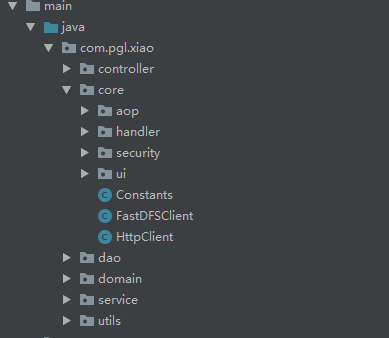
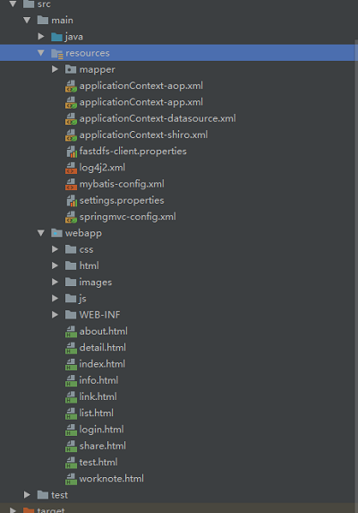

# news

#### 介绍
个人的新闻博客系统，基于Spring 5 + MyBatis 3.4的Java EE技术开发而成，文件存储采用了FastDFS + Nginx中间件，Redis作为缓存数据库，Tomcat 8.5，JRE 1.8以上环境。已经部署至个人的云服务器。

#### 运行环境
1. JDK 1.8
2. Maven 3.5
3. MySQL 5.7 端口号：3306
4. Nginx 服务器端口号：80
5. Tomcat 服务器端口号：8080
6. Redis 数据库

#### 代码结构

工程截图1

工程截图2

> news -- 项目根目录

> > src -- 源代码根目录

> > > main -- 主要发布代码

> > > > java -- 主要后端代码

> > > > > controller -- Spring MVC 控制器层

> > > > > core -- 核心配置类

> > > > > > aop -- Spring AOP 切面

> > > > > > handler -- 些文件上传下载的配置器

> > > > > > security --- 安全配置类

> > > > > > ui -- UI Widget 配置 

> > > > > dao -- 数据访问层

> > > > > domain -- Model数据层

> > > > > service -- 业务服务层

> > > > > utils -- 工具

> > > > resources -- 配置文件

> > > > webapp -- 前端静态页面

> > > test -- 测试代码

> > pom.xml -- 项目依赖描述文件

#### 安装教程

1.  修改 src/main/resources/settings.propertis文件

2.  运行mvn install 命令执行程序

#### 页面效果预览

管理员登录

#### 开发者链接

+ [CSDN博客](https://blog.csdn.net/qq_39694327) 
+ [Gitee](https://gitee.com/x745567172) (更新比较频繁，代码不太稳定)
+ [GitHub](https://github.com/jjva-xiao) （更新比较慢，代码比较稳定）

